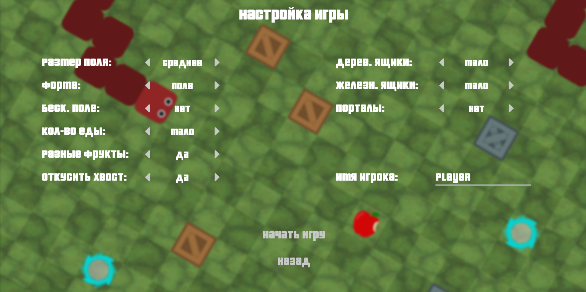
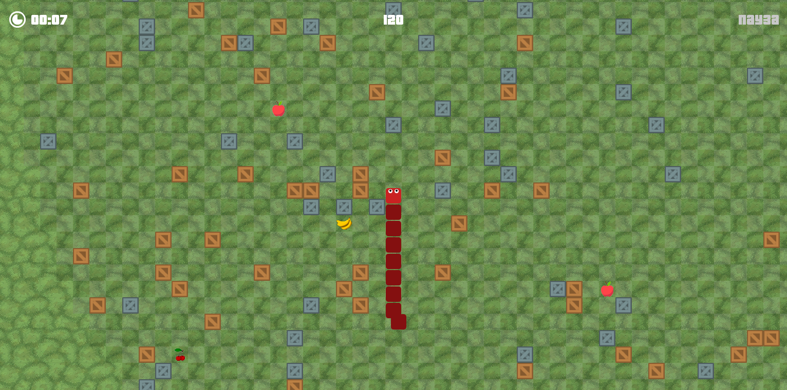

# Yet Another Snake Game

2d snake game using C++ and SFML as graphics library. Includes simple custom game modes.

> It was a begginer student project developed to learn about different aspect of C++ development.

## Screenshots

## Requirements

### Must Have (dependencies)
SFML 2.5.1 or above - http://www.sfml-dev.org/

### Windows
Download SFML to Library/SFML Folder.

## Contribution & Development
* Lots of work required because of awful crashes, bugs, etc.
* Very unaccurate code base so it's need to be rewrited.

Maybe this project will be futher developed once, but not now.
Feel free to fork, fix the issues and contribute.

## License
This project is under MIT license